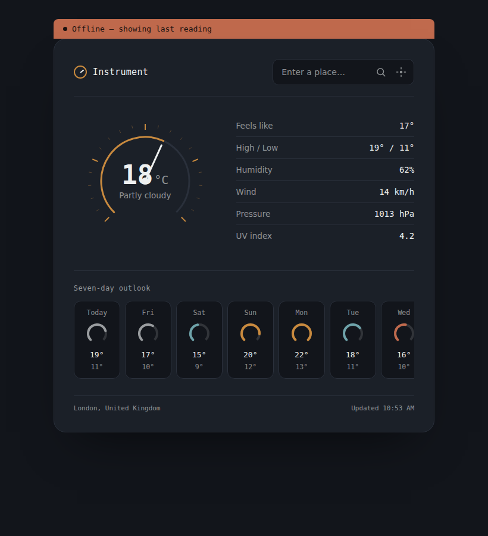

# Instrument — Offline Weather PWA

A weather dashboard styled like an analog instrument panel — a dial instead of an icon, a ledger instead of a card grid. It installs like a native app and keeps showing your last reading when you lose connection.

**[Live demo →](#)** *(replace with your GitHub Pages URL once deployed)*



## Features

- **Analog dial readout** — current temperature rendered as a hand-drawn SVG gauge, not a stock weather icon
- **Seven-day outlook** — a horizontal strip of mini-gauges scaled against the week's range
- **Works offline** — a service worker caches the app shell and last API response; the last reading is also saved to `localStorage`, so the dashboard is never blank, even on first load with no connection
- **No API key required** — weather data comes from [Open-Meteo](https://open-meteo.com/), free and keyless
- **Installable** — has a manifest and icons, so it can be added to your home screen or dock like a native app
- **Location search or geolocation** — type a place name or use your current position

## Tech stack

Vanilla HTML, CSS, and JavaScript — no build step, no framework, no dependencies. Just static files you can open directly or deploy to any static host.

- `index.html` / `style.css` / `app.js` — the app
- `sw.js` — service worker (network-first for weather calls, cache-first for the app shell)
- `manifest.json` + `icons/` — PWA installability
- `make_icons.py` — regenerates the app icons (requires Pillow)

## Running locally

Because service workers require a real origin (not `file://`), serve the folder instead of opening `index.html` directly:

```bash
python3 -m http.server 8000
# then open http://localhost:8000
```

## Deploying

This is a static site, so it works as-is on GitHub Pages, Netlify, Vercel, or any static host:

```bash
# GitHub Pages, from the repo root
git push origin main
# then enable Pages in the repo settings, serving from main/
```

## How the offline caching works

1. On install, the service worker precaches the app shell (HTML, CSS, JS, icons).
2. Weather and geocoding requests are network-first: if the network responds, that response is shown and cached; if it fails, the last cached response is served instead.
3. Every successful reading is also written to `localStorage`, so the dial, ledger, and forecast render instantly on load — before any network request resolves — using whatever was last saved.

## License

MIT
